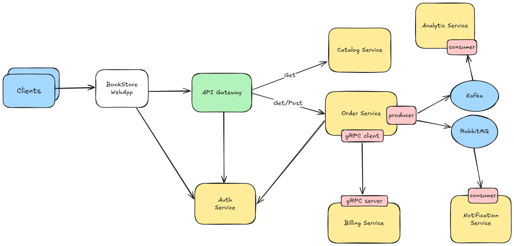
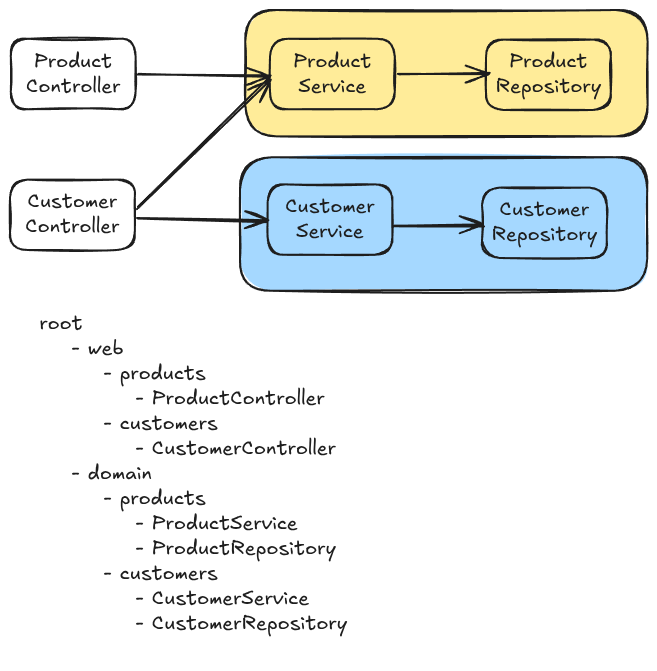
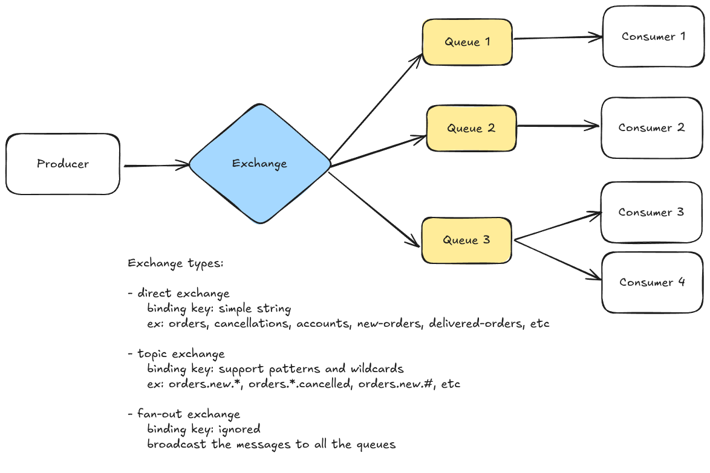
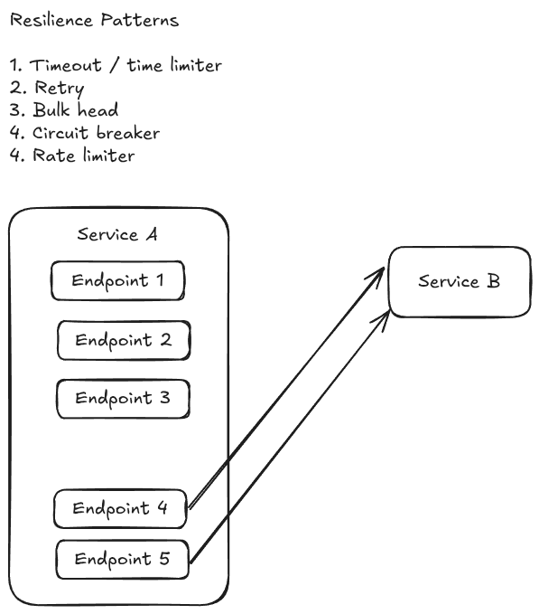
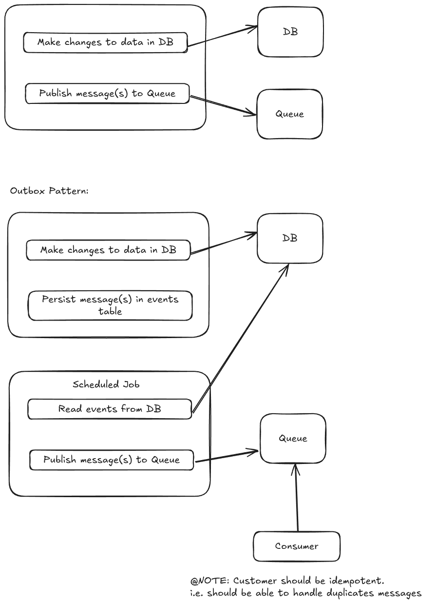
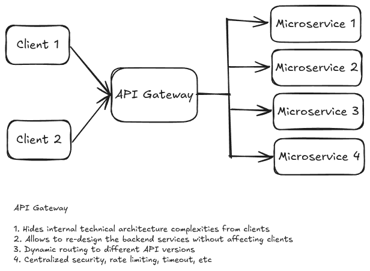

# Spring Micro Bookstore

## Architecture Diagrams

<strong>System Architecture Overview</strong>

  
<strong>Package by Components</strong>

  

  
<strong>RabbitMQ Architecture</strong>

  

  
<strong>Resilience Patterns</strong>

  

  
<strong>Outbox Pattern</strong>

  

  
<strong>API Gateway</strong>

  

