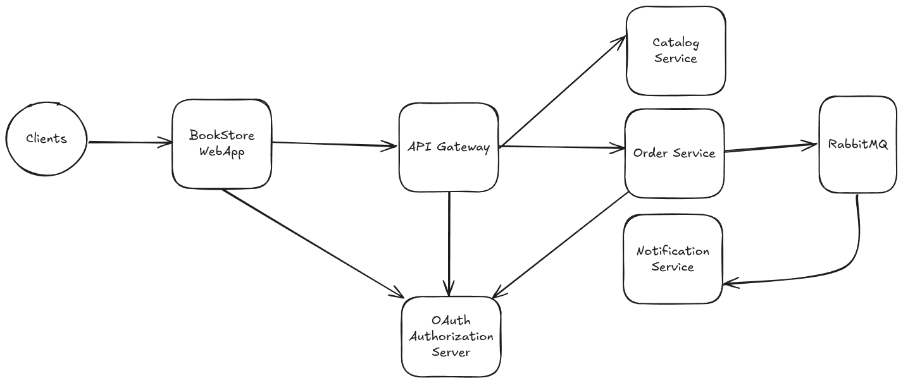

# Spring Micro Bookstore

## Architecture Diagrams

  
<strong>Microservices architecture</strong>

  

  
<strong>Package by components</strong>

  

  
<strong>RabbitMQ architecture</strong>

  

  
<strong>Resilience patterns</strong>

  

  
<strong>Outbox pattern</strong>

  

  
<strong>API gateway</strong>

  

